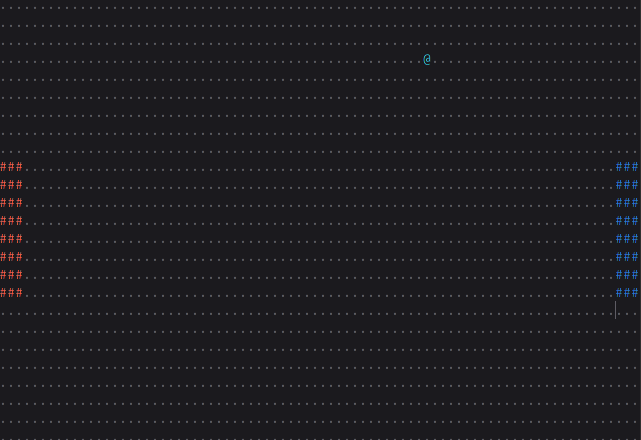

# pong-sh
ASCII Pong in a single Linux shell script that runs on your terminal.
( Image from `gnome-screenshot` )

# running
To run the game, just copy the shell script and run it in a terminal with `sh script.sh`. There arent any dependencies required at the moment. The controls are:

__First Paddle:__
W (up)
S (down)

__Second Paddle:__
E (up)
D (down)
